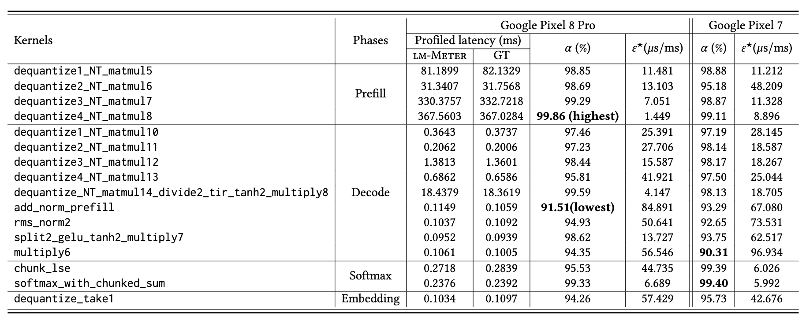

<div align="center">

# LM-Meter  
[](https://github.com/amai-gsu/lm-Meter-Private-Experiment/tree/main/docs)
[](./LICENSE)
[](https://www.amai-gsu.us/)

**Online Kernel-Level Profiler for On-Device LLMs**

[Get Started](docs/install.md) | [📘 Documentation](docs/) | [📑 Paper](https://www.amai-gsu.us/wp-content/uploads/2025/lm-meter.pdf) | [🎥 Demo Video](#) (coming soon) | [🖥️ Slides](#) (coming soon)

</div>

## About
LM-Meter is a lightweight, online profiler for large language models (LLMs) running on mobile and edge devices. The mission of this project is to provide fine-grained, real-time visibility into on-device LLM inference at both phase and kernel levels, enabling researchers and developers to understand performance-efficiency trade-offs, identify bottlenecks, and systematically optimize models for resource-constrained platforms.

<div align="center">
<p align="center">
  ✅ Released &nbsp;&nbsp;|&nbsp;&nbsp; 🚧 Coming Soon &nbsp;&nbsp;|&nbsp;&nbsp; ❌ Not Supported
</p>
<table style="width:100%; text-align:center;">
  <thead>
    <tr>
      <th style="width:15%"></th>
      <th style="width:20%">Android GPU<br/><sub>OpenCL</sub></th>
      <th style="width:20%">iOS GPU<br/><sub>Metal</sub></th>
      <th style="width:20%">NVIDIA Jetson<br/><sub>CUDA / Vulkan</sub></th>
      <th style="width:20%">Coral TPU<br/></th>
    </tr>
  </thead>
  <tbody>
    <tr>
      <td><b>MLC LLM</b></td>
      <td align="center">✅</td>
      <td align="center">🚧</td>
      <td align="center">🚧</td>
      <td align="center">❌</td>
    </tr>
    <tr>
      <td><b>llama.cpp</b></td>
      <td align="center">🚧</td>
      <td align="center">🚧</td>
      <td align="center">🚧</td>
      <td align="center">❌</td>
    </tr>
    <tr>
      <td><b>vLLM</b></td>
      <td align="center">❌</td>
      <td align="center">❌</td>
      <td align="center">🚧</td>
      <td align="center">🚧</td>
    </tr>
  </tbody>
</table>
</div>

## Getting Started
- [Installation](docs/install.md) 
- [Run and Eval](docs/eval.md)
- [Troubleshooting Tips](docs/common-errors.md)

## LM-Meter Performance & Overhead

### 1. Phase-level profiling accuracy on Pixel 8 Pro:

<h3>Table 4. Phase-level profiling accuracy on Pixel 8 Pro</h3>

<table style="border-collapse: collapse; font-size: 12px; text-align: center; width: 100%; border: 1px solid #000;">
  <thead>
    <tr>
      <th rowspan="2" style="border: 1px solid #000; padding: 4px;">Models</th>
      <th rowspan="2" style="border: 1px solid #000; padding: 4px;">Phases</th>
      <th colspan="2" style="border: 1px solid #000; padding: 4px;">Profiled latency (ms)</th>
      <th rowspan="2" style="border: 1px solid #000; padding: 4px;">α (%)</th>
      <th rowspan="2" style="border: 1px solid #000; padding: 4px;">ε★ (μs/ms)</th>
    </tr>
    <tr>
      <th style="border: 1px solid #000; padding: 4px;">LM-METER</th>
      <th style="border: 1px solid #000; padding: 4px;">AGI</th>
    </tr>
  </thead>
  <tbody>
    <!-- Llama -->
    <tr>
      <td rowspan="7" style="border: 1px solid #000; padding: 4px; writing-mode: vertical-rl; transform: rotate(180deg);">Llama-3.2-3B-Instruct</td>
      <td>Embedding</td><td>0.8038</td><td>0.7763</td><td>96.46</td><td>35.412</td>
    </tr>
    <tr><td>Prefill</td><td>3433.8628</td><td>3433.8142</td><td>99.99</td><td>0.014</td></tr>
    <tr><td>Decode</td><td>62.5669</td><td>62.5303</td><td>99.94</td><td>0.585</td></tr>
    <tr><td>Softmax</td><td>142.6166</td><td>142.6542</td><td>99.97</td><td>0.264</td></tr>
    <tr><td>CopyProbsToCPU</td><td>0.4929</td><td>0.4616</td><td>93.22</td><td>67.718</td></tr>
    <tr><td>Sampling</td><td>0.0675</td><td>0.0824</td><td>81.86</td><td>181.439</td></tr>
    <tr><td><b>End-to-end</b></td><td><b>3640.4104</b></td><td><b>3640.3191</b></td><td><b>99.99</b></td><td><b>0.025</b></td></tr>
    <!-- Gemma -->
    <tr>
      <td rowspan="7" style="border: 1px solid #000; padding: 4px; writing-mode: vertical-rl; transform: rotate(180deg);">Gemma-2-2B-it</td>
      <td>Embedding</td><td>0.7659</td><td>0.7398</td><td>96.48</td><td>35.226</td>
    </tr>
    <tr><td>Prefill</td><td>9301.1318</td><td>9301.0589</td><td>99.99</td><td>0.008</td></tr>
    <tr><td>Decode</td><td>54.5909</td><td>54.5557</td><td>99.94</td><td>0.646</td></tr>
    <tr><td>Softmax</td><td>502.3319</td><td>502.3698</td><td>99.99</td><td>0.076</td></tr>
    <tr><td>CopyProbsToCPU</td><td>0.5570</td><td>0.5255</td><td>94.02</td><td>59.829</td></tr>
    <tr><td>Sampling</td><td>0.1698</td><td>0.1830</td><td>92.76</td><td>72.365</td></tr>
    <tr><td><b>End-to-end</b></td><td><b>9859.5473</b></td><td><b>9859.4329</b></td><td><b>99.99</b></td><td><b>0.012</b></td></tr>
    <!-- DeepSeek -->
    <tr>
      <td rowspan="7" style="border: 1px solid #000; padding: 4px; writing-mode: vertical-rl; transform: rotate(180deg);">DeepSeek-R1-Distill-Qwen-1.5B</td>
      <td>Embedding</td><td>0.6753</td><td>0.6531</td><td>96.60</td><td>33.975</td>
    </tr>
    <tr><td>Prefill</td><td>7630.7553</td><td>7630.6979</td><td>99.99</td><td>0.008</td></tr>
    <tr><td>Decode</td><td>49.3840</td><td>49.3499</td><td>99.93</td><td>0.690</td></tr>
    <tr><td>Softmax</td><td>437.0047</td><td>437.0459</td><td>99.99</td><td>0.094</td></tr>
    <tr><td>CopyProbsToCPU</td><td>0.4206</td><td>0.3888</td><td>91.84</td><td>81.565</td></tr>
    <tr><td>Sampling</td><td>0.0671</td><td>0.0786</td><td>85.41</td><td>145.949</td></tr>
    <tr><td><b>End-to-end</b></td><td><b>8118.3069</b></td><td><b>8118.2143</b></td><td><b>99.99</b></td><td><b>0.011</b></td></tr>
  </tbody>
</table>


### 2. Kernel-level profiling accuracy on Pixel 8 Pro and Pixel 7:




### 3. Kernel-level profiling accuracy on Pixel 8 Pro:

## Bibtex
If this work is helpful for your research, please consider citing the following BibTeX entry.

```
@inproceedings{wang2025sec,
  author    = {Wang, Haoxin and Tu, Xiaolong and Ke, Hongyu and Chai, Huirong and Chen, Dawei and Han, Kyungtae},
  title     = {lm-Meter: Unveiling Runtime Inference Latency for On-Device Language Models},
  booktitle = {Proc. The Tenth ACM/IEEE Symposium on Edge Computing (SEC)},
  pages     = {1--17},
  year      = {2025},
}
```

## Acknowledgement

Many thanks to these excellent open source projects:
- [MLC LLM](https://llm.mlc.ai/) 
- [tvm](https://github.com/apache/tvm)